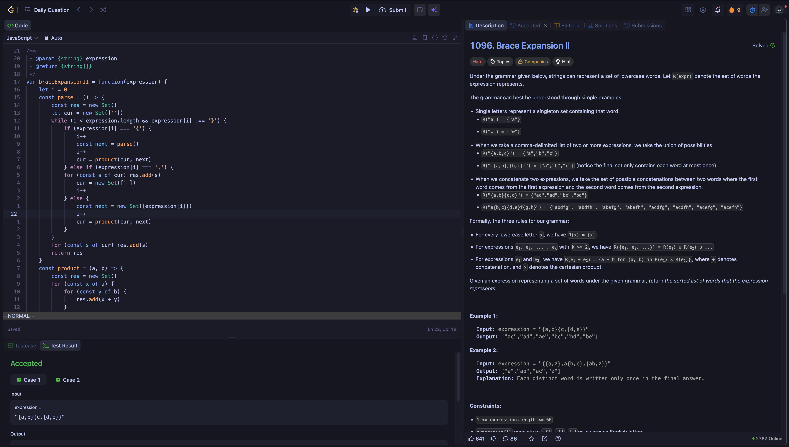

# LeetCode Tokyo Night (Dynamic Layout Support)

A clean, modern Tokyo Night dark theme for LeetCode with complete support for the dynamic split-panel IDE layout.



---

## Features

- **Tokyo Night Palette:** Accurately ported colors from the official Tokyo Night theme.
- **Dynamic Layout Support:** Styled flexlayout panels, splitters, tabs, and modals.
- **Monaco Editor Styling:** Full syntax highlighting and editor tokens matching the palette.
- **Typography:** Uses `Roboto Mono` for clear code readability.
- **Comprehensive UI Coverage:** Buttons, inputs, tables, tags, dropdowns, and problem description views.
- **Zero Distractions:** Cleaner layout, hidden ads/prompts, and styled custom scrollbars.

---

## Color Palette

| Token                 | Hex       | Role                                |
| :-------------------- | :-------- | :---------------------------------- |
| **Background Dark**   | `#16161E` | Main page background, Monaco gutter |
| **Background Base**   | `#1A1B26` | Card backgrounds, panels, modals    |
| **Surface / Borders** | `#282B3C` | Tabs, borders, code blocks          |
| **Text Primary**      | `#C0CAF5` | Primary body and editor text        |
| **Text Muted**        | `#565F89` | Secondary labels, line numbers      |
| **Blue Accent**       | `#7AA2F7` | Active borders, links, keywords     |
| **Cyan**              | `#7DCFFF` | Accents, links on hover             |
| **Orange**            | `#FF9E64` | Numbers, constants                  |
| **Green**             | `#9ECE6A` | Strings, success states             |
| **Red**               | `#F7768E` | Errors, tags                        |

---

## Installation

### Option 1: Direct Install via Stylus (Recommended)

1. Install the [Stylus extension](https://github.com/openstyles/stylus) for your browser (Chrome, Firefox, Edge).
2. Install directly from [UserStyles.world](https://userstyles.world)

### Option 2: Manual Setup

1. Open the **Stylus** dashboard.
2. Click **Write new style**.
3. Set the name to `LeetCode Tokyo Night` and configure the domain rule to:
   ```text
   URLs on the domain: leetcode.com
   ```
